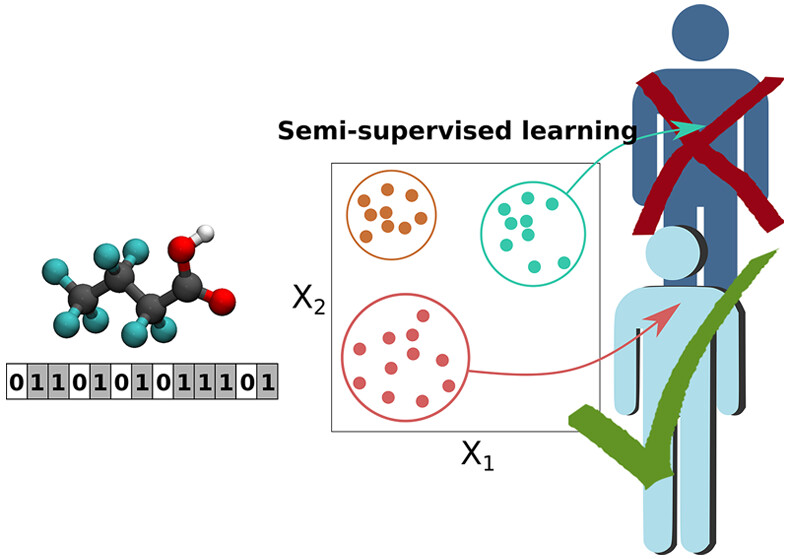

### Perfluoroalkyl substances (PFAS) 

#### Current Challenges:
Perfluoroalkyl substances (PFAS) are a group of man-made chemicals that are highly persistent in the environment and human body, leading to adverse health effects. Major challenges include:
- **Persistence**: PFAS are often called "forever chemicals" because they don't break down easily in the environment.
- **Toxicity**: Emerging research links PFAS to several serious health conditions such as cancer, hormone disruption, and immune system dysfunction.
- **Remediation**: Current methods to remove or degrade PFAS from water and soil are expensive and not entirely efficient.

To address these challenges, I have applie machine learning approached to uncover structure-property relationship to predict bioactivities and degradability of PFAS.

#### Key Publications:

19. **Grand canonical generative diffusion model for crystalline phases and grain boundaries**  
   B Lei, E Chen, **H Kwon**, T Hsu, B Sadigh, V Lordi, T Frolov, F Zhou  
   *arXiv preprint arXiv:2408.15601*
   [Read the paper](https://arxiv.org/abs/2408.15601)  

18. **Spectroscopy-Guided Discovery of Three-Dimensional Structures of Disordered Materials with Diffusion Models**  
   **H Kwon***, T Hsu*, W Sun, W Jeong, F Aydin, J Chapman, X Chen, ...  
   * Equal contribution  
   *Accepted; Machine Learning: Science & Technology*
   [Read the paper](https://arxiv.org/abs/2312.05472)  

